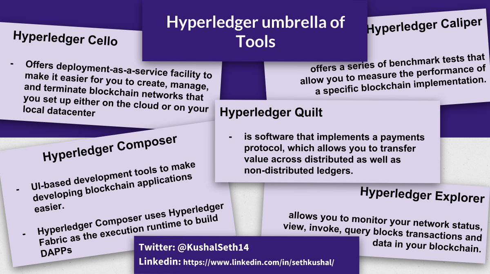
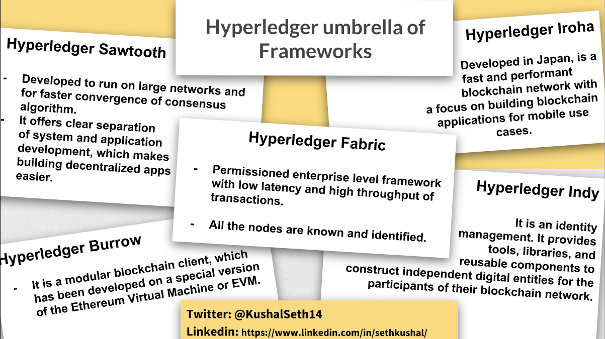
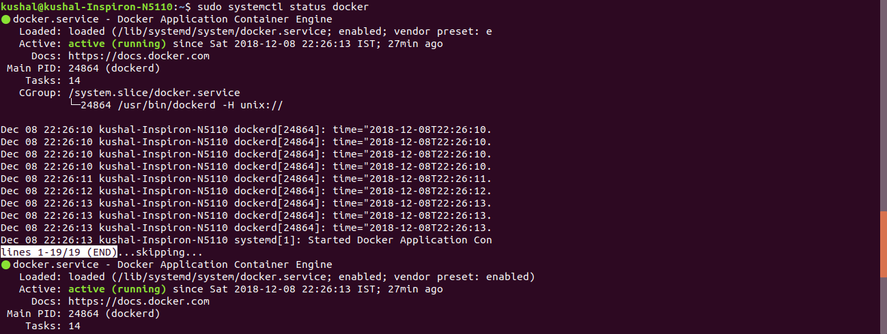

# BUILDING BLOCKCHAINS WITH HYPERLEDGER

#### Overview
- **Hyperledger Composer**, a web-based user interface who build real-world business applications with **fabric networks**. 
- **Hyperledger Iroha framework**, which has been designed to work with constrained environments, such as mobile devices.
-  **Hyperledger Sawtooth**, which can scale to even very large networks. 
-  **Hyperledger Cello**, a tool currently in incubation that has been built to make building and deploying blockchain networks easier than it is today. 

# INTRODUCTION TO HYPERLEDGER
- **Hyperledger Composer:** It allows users to model the business networks, assets, and transactions that are required for blockchain applications, and to implement those transactions by using simple JavaScript functions. The blockchain applications run on instances of Linux Foundation Hyperledger Fabric

- **Distributed Ledgers**
    - Blockchain can be thought of as encrypted databses of agreements
    - Hyperledger Sawtooth uses proof of elapsed time consensus.

- **How do blockchain frameworks ensure that the transactions, once added, are permanent, immutable, incorruptible, and transparent?** 
    - A blockchain is a growing list of records called blocks, which are linked cryptographically. Each block in our blockchain contains the hash of the previous block in that chain.    
    - And this hash is the cryptographic link that ensures that the transactions added to your blockchain are immutable and incorruptible transaction data in a particular block,
     
-  **Hyperledger:** 
    -  Hyperledger is an umbrella project of open source blockchain platforms and tools to work with blockchain technology. This was started in December 2015 by the Linux Foundation. 
    -  Hyperledger umbrella of Frameworks, consist of 
        - Hyperledger Fabric
        - Hyperledger Sawtooth
        - Hyperledger Iroha
        - Hyperledger Burrow
        - Hyprledger Indy
    
    - 
    
    - **Hyperledger Fabric** is an enterprise grade permissioned framework with low latency and high throughput of transactions. All of the nodes participating in a Fabric network are known and identified. At this point in time, Hyperledger Fabric is the most stable and widely used of all the hyperledger frameworks. Hyperledger Fabric was explicitly built to mitigate many of the concerns around Ethereum, or a platform, which uses a very computationally intensive proof of work algorithm for consensus. 
    
    -  **Hyperledger Sawtooth** has been developed to run on large networks and for faster convergence of consensus algorithm. It offers clear separation of system and application development, which makes building decentralized apps easier. Once again, targeted at enterprises, its modular design can allow users to choose transaction processing rules, permissioning, and consensus algorithms based on their use case.
    
    - **Hyperledger Iroha** developed in Japan, is a fast and performant blockchain network with a focus on building blockchain applications for mobile use cases. 
      
    -  **Hyperledger Burrow** is a modular blockchain client, which has been developed on a special version of the Ethereum Virtual Machine or EVM. This is what powers the nodes of an Ethereum network.
    
    -  **Hyperledger Indy** specializes an identity management. It provides tools, libraries, and reusable components to construct independent digital entities for the participants of their blockchain network.
     
    -  Hyperledger umbrella of Tools, consist of   
        -  Hyperledger Composer 
        -  Hyperledger Cello 
        -  Hyperledger Caliper 
        -  Hyperledger Explorer 
        -  Hyperledger Quilt
    
    - 
    -  **Hyperledger Composer** offers browser UI-based development tools to make developing blockchain applications easier. You can simply use point and click and fill in forms on the UI to model resources, transactions, and participants in your network. Hyperledger Composer uses Hyperledger Fabric as the execution runtime to build decentralized applications.
    
    - **Hyperledger Cello** offers deployment-as-a-service facility to make it easier for you to create, manage, and terminate blockchain networks that you set up either on the cloud or on your local datacenter.  
    
    - **Hyperledger Caliper** offers a series of benchmark tests that allow you to measure the performance of a specific blockchain implementation. There are a set of pre-defined use cases that Caliper will run against your blockchain network. 
    
    -  **Hyperledger Explorer** offers a browser-based dashboard for your blockchain network. It's a web application, which allows you to monitor your network status, view, invoke, query blocks transactions and data in your blockchain.
    
    - **Hyperledger Quilt** is software that implements a payments protocol, which allows you to transfer value across distributed as well as non-distributed ledgers.  


 

# DOCKER

-  Docker is a container technology which packages all of this arbitrary code needed to run your application into something called an image. An image is a completely self-sufficient package, which contains everything needed to host and run your application. An image in Docker is used to create and execute containers. An image can be used to run a Docker container. You can run one or more containers from the same image. These containers can be thought of as sandbox environments, which host and run your code. 

```
INSTALLING DOCKER & DOCKER-COMPOSER ON UBUNTU

ref: https://medium.com/devgorilla/how-to-install-docker-on-ubuntu-18-04-495216a16092

step 1: curl -fsSL https://download.docker.com/linux/ubuntu/gpg | sudo apt-key add -
step 2: sudo add-apt-repository "deb [arch=amd64] https://download.docker.com/linux/ubuntu $(lsb_release -cs) stable edge"

step 3: apt-cache policy docker-ce

step 4: sudo apt-get install -y docker-ce

step 5:(to start the docker) sudo systemctl status docker

step 6:[install composer] sudo apt install docker-compose

step 7: sudo usermod -aG docker ${USER}

step 8: su ${USER}

step 9: id -nG

Test the docker & composer version
1. docker --version
2. docker-compose --version
```



    
# Detailed Description 
- Details about Hyperledger Fabric: hyperledger_fabric.md    

